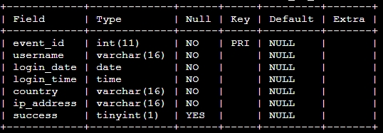
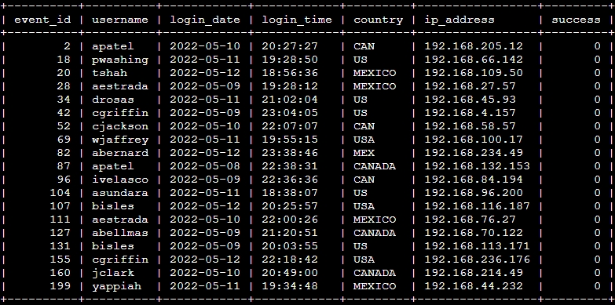
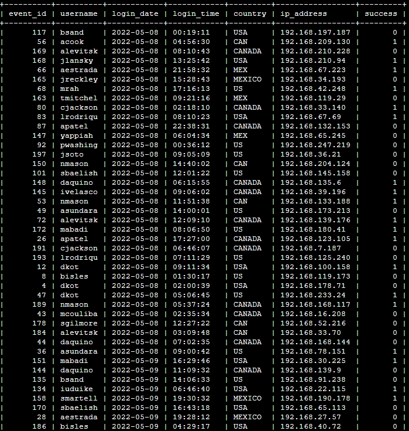

# Apply filters to SQL queries

## Project description
In this project I will demonstrate basic knowledge of SQL filtering with the AND, OR, and NOT operators based on a fictional scenario. This scenario is:

I am a security professional at a large organization. Part of my job is to investigate security issues to help keep the system secure. I recently discovered some potential security issues that involve login attempts and employee machines. My task is to examine the organization's data in their `employees` and `log_in_attempts` tables using SQL filters to retrieve records from different datasets and investigate the potential security concerns.

## Retrieve after hours failed login attempts
I found that the potential security event happened after hours (after 18:00). Therefore, I wanted to investigate all login attempts that failed after 18:00. To determined this, I needed to query the `log_in_attempts` table which contains columns identifying the user, the login date, login time, country, IP address, and whether the login was successful. The table columns are as specified here:



The specific query to extract all logins after18
```sql
SELECT *
FROM log_in_attempts
WHERE login_time > '18:00' AND success = FALSE;
```

This query returns all of the columns of `log_in_attempts' but only rows where the login attempt both failed and occurred after 18:00, using the AND operator since both criteria need to be true before returning the record. The records that meet these criteria are shown below.



## Retrieve login attempts on specific dates
A suspicious event occurred on 2022-05-09, and to investigate it we wanted to review all login attempts which occurred on that date, as well as the day before. To find these login attempts, we need to get all records where the login date is either 2022-05-09 or 2022-05-08, therefore we will use the OR operator when filtering the database records. The SQL query is
```sql
SELECT *
FROM log_in_attempts
WHERE login_date = '2022-05-08' OR login_date = '2022-05-09';
```
If we use `ORDER BY login_date` we get the table below:



## Retrieve login attempts outside of Mexico
We have determined that there has been suspicious activity with login attempts, but they did not originate in Mexico. Therefore, we will need to investigate login attempts that occurred outside of Mexico. Our query will need to check the `country` value in each record, and only output those that are not Mexico. Naively, we could use the query:
```sql
SELECT *
FROM log_in_attempts
WHERE NOT country = 'MEXICO';
```
However, looking at the output, we see that there are entries where `country` contains the value `MEX` rather than `MEXICO`. To filter all login attempts from Mexico, we need to take into accout this inconsistency in the database and remove any record where `country` is equal to `MEX` or `MEXICO`. We could filter using the query below which looks explicitly for both forms of the country name.

```sql
SELECT *
FROM log_in_attempts
WHERE NOT country = 'MEXICO' AND NOT country = 'MEX';
```

As long as the record does not contain Mexico or MEX, it will be output. It is also possible to use the `LIKE` keyword to find records with similar values for country. If we replace the last line in the above SQL query with `WHERE NOT country LIKE 'MEX%'` it will filter for any country name starting with `MEX`. This is because the percent sign (`%`) is a wildcard and stands in for any combination of characters after `MEX`, including `MEXICO`. The full query is below.

```sql
SELECT *
FROM log_in_attempts
WHERE NOT country LIKE 'MEX%';
```

## Retrieve employees in Marketing
I am responsible for getting information on the devices used by members of the Marketing department so that our team can perform security updates on specific employee machines. At this point in time we need to identify employees of the Marketing department who are also in the East Building. The `department` column of the `employee` table contains `Marketing` if they are in the Marketing department. The office name includes the building name and a number in the format `East-170` or `North-434`. Therefore, when we filter for the East building, we need to include records that start with East and end with any office number.

```sql
SELECT *
FROM employees
WHERE department = 'Marketing' and office LIKE 'East-%';
```
The `WHERE` component only accepts a record if both the `department` is Marketing and the `office` column contains `East-` and the `%` corresponds to any office number.

## Retrieve employees in Finance or Sales
Our team now needed to perform updates on machines for employees in the Sales and Finance departments, and I needed to query the database to obtain a list of the employees that would be affected. The query to do this is:
```sql
SELECT *
FROM employees
WHERE department = 'Sales' OR department = 'Finance';
```

The SELECT/FROM block selects all data from the employees table. I used the OR operator to filter records as long as the employee department was either `Sales` or `Finance`.

## Retrieve all employees not in IT
The final updates required for this project was to apply updates to all users outside of the Information Technology department, since they already recieved the update. To apply these updates, I needed to get the information about all of the employees in other departments. The easiest way to achieve this is to use the `NOT` operator since it allows us to check whether a user is in Information Technology and not include them in the output, while allowing all other records through the filter. Therefore, SQL query I created to filter employees not in Information Technology is:
```sql
SELECT *
FROM employees
WHERE NOT department = 'Information Technology'
```
The `WHERE` clause with the `NOT` operator filters from all employees those who are in departments other than Information Technology.

## Summary
By the end of this project, I applied various filters to SQL queries to get specific information about login attempts and employee machines. This involved queries on records in two tables, `log_in_attempts` and `employees` respectively, and filters using `AND`, `OR`, and `NOT` operators to filter the specific information we needed, as well as the `LIKE` keyword and `%` wildcard to filter based on patterns without explicitly enumerating them.
