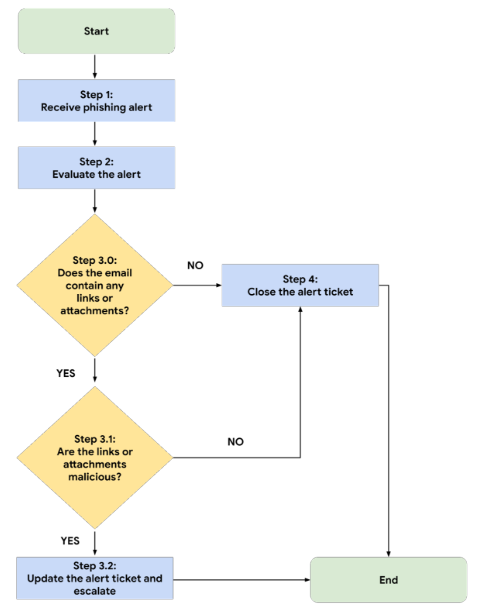

# Portfolio Activity - Document Incident Responses

## Incident 1

A small U.S. health care clinic specializing in delivering primary-care services experienced a security incident on a Tuesday morning, at approximately 9:00 a.m. Several employees reported that they were unable to use their computers to access files like medical records. Business operations shut down because employees were unable to access the files and software needed to do their job.

Additionally, employees also reported that a ransom note was displayed on their computers. The ransom note stated that all the company's files were encrypted by an organized group of unethical hackers who are known to target organizations in healthcare and transportation industries. In exchange for restoring access to the encrypted files, the ransom note demanded a large sum of money in exchange for the decryption key. 

The attackers were able to gain access into the company's network by using targeted phishing emails, which were sent to several employees of the company. The phishing emails contained a malicious attachment that installed malware on the employee's computer once it was downloaded.

Once the attackers gained access, they deployed their ransomware, which encrypted critical files. The company was unable to access critical patient data, causing major disruptions in their business operations. The company was forced to shut down their computer systems and contact several organizations to report the incident and receive technical assistance.

### Journal Entry 1

## Incident 2

You are a level one security operations center (SOC) analyst at a financial services company. You have received an alert about a suspicious file being downloaded on an employee's computer. 

You investigate this alert and discover that the employee received an email containing an attachment. The attachment was a password-protected spreadsheet file. The spreadsheet's password was provided in the email. The employee downloaded the file, then entered the password to open the file. When the employee opened the file, a malicious payload was then executed on their computer. 

You retrieve the malicious file and create a SHA256 hash of the file. You might recall from a previous course that a hash function is an algorithm that produces a code that can't be decrypted. Hashing is a cryptographic method used to uniquely identify malware, acting as the file's unique fingerprint. 

Now that you have the file hash, you will use VirusTotal to uncover additional IoCs that are associated with the file.

### Journal Entry 2

## Incident 3
You are a level-one security operations center (SOC) analyst at a financial services company. Previously, you received a phishing alert about a suspicious file being downloaded on an employee's computer. After investigating the email attachment file's hash, the attachment has already been verified malicious. Now that you have this information, you must follow your organization's process to complete your investigation and resolve the alert.

Your organization's security policies and procedures describe how to respond to specific alerts, including what to do when you receive a phishing alert. 

In the playbook, there is a flowchart and written instructions to help you complete your investigation and resolve the alert. At the end of your investigation, you will update the alert ticket with your findings about the incident.

### Journal Entry 3
