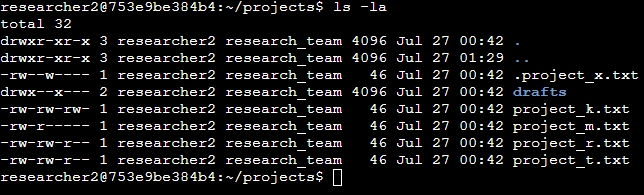
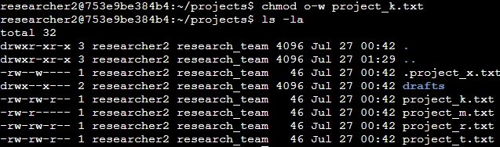
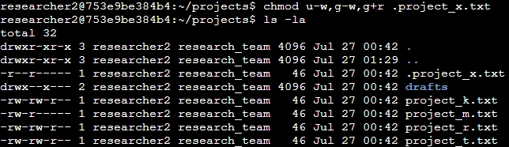
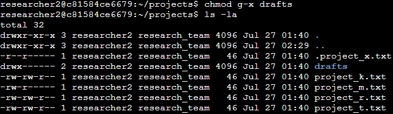

# File permissions in Linux
## Project description
In this project, I will demonstrate my knowledge of Linux for managing file permissions based on the following fictional scenario:

You are a security professional at a large organization who largely works with the organization's research team. Part of your job is to ensure users are authorized with the appropriate permissions to maintain the security of the system.
You need to examine existing permissions on the file system, and determine if the permissions match the authorization that dhould be given. In cases where the permissions do not match the requirements, they will need to be modified to
authorized the appropriate users and remove and unauthorized access that should not be allowed.

## Check file and directory details
We must manage the permissions on the files in the `/home/researcher2/projects` directory. The initial files and permissions belongining to the `researcher2` user are listed here:

The `ls -la` command was used to list all contents of the directory, including hidden files, along with their permissions.

## Describe the permissions string

- The 1st character indicates the file type. The `d` indicates it’s a directory. When this character is a hyphen (`-`), it's a regular file.
- The 2nd-4th characters indicate the read (`r`), write (`w`), and execute (`x`) permissions for the user. When one of these characters is a hyphen (`-`) instead, it indicates that this permission is not granted to the user.
- The 5th-7th characters indicate the read (`r`), write (`w`), and execute (`x`) permissions for the group. When one of these characters is a hyphen (`-`) instead, it indicates that this permission is not granted for the group.
- The 8th-10th characters indicate the read (`r`), write (`w`), and execute (`x`) permissions for the owner type of other. This owner type consists of all other users on the system apart from the user and the group. When one of these characters is a hyphen (`-`) instead, that indicates that this permission is not granted for other.

In the screenshot above, it can be seen that there are five projects with one, `.project_x.txt` being hidden, as well as a drafts folder. Using `project_t.txt` as an example, the intial permissions are `-rw-rw-r--`. This 10 character string describes the permissions for the user, currently `researcher2`, the group, `research_team`, and all other users. The hyphen in the first place indicates that `project_t.txt` is a file, not a directory. The characters at positions 2, 3, and 4 show that the user has read and write permissions, but the hyphen at position 4 means they do not have execute permissions, which would be `x` if true. Similarly, the next 3 characters show that the group also has read and write permissions only. Finally, the final 3 characters show that other users only have read permissions as the write/execute positions (9, 10) are hyphens.

## Change file permissions
The organization has determined that other users should never have write access to any files. Therefore, based on the permissions above I needed to change the permissions for `project_k.txt`. To change the permissions, I used the `chmod` command, specifically `chmod o-w project_k.txt`. With `chmod`, the `o` sets permissions for others, and the '-w` indicates that the write permission is removed from the other.

The image above shows the results of the `chmod o-w project_k.txt` command, and now other users are only able to read the file.

## Change file permissions on a hidden file
The research team has archived `.project_x.txt`, which is why it is now a hidden file, and it should not have write permissions for anyone, and only user and group should be able to read the file. As we can see in the initial screenshot above, current both users and group have write permisions, which needs to be removed from both. The other change we need is to provide the group with read permissions. The command to set these permissions is `chmod u-w,g-w,g+r .project_x.txt`. The user and group write permissions are removed by the options `u-w` and `g-w`, and the group is given read permission with `g+r`. While these could be affected seprately, chmod allows multiple changes in a single command if they are separated by commas. The results of this command can be seen below:

## Change directory permissions
Only `researcher2` should be able to access the draft directory and its contents, but currently groups are given execute permissions, allowing group members to also access the files in the directory. Since the user already has `rwx` permissions on the `drafts` folder, there are no changes needed to the user permissions. However, we need to remove the group execute permission on it. This can be done with the command `chmod g-x drafts`. The result of this command is shown here:

## Summary
Using multiple `chmod` commands on each file, I was able to change their permissions to match the authorization level requirements provided by my organization.
